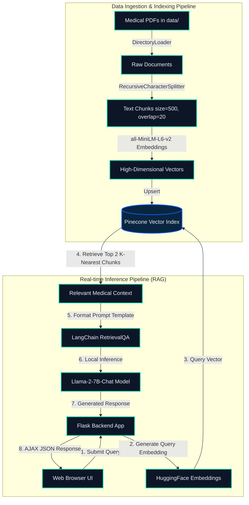

# MedBot AI — End-to-End Medical Chatbot

MedBot AI is a professional, state-of-the-art **Retrieval-Augmented Generation (RAG)** Medical Chatbot. It leverages a local **Llama 2-7B** Large Language Model and a cloud-based **Pinecone Vector Database** to deliver evidence-based, contextual answers to medical queries.

The project features a **premium glassmorphism web interface** designed with modern UI/UX principles, including animated backgrounds, live status monitoring, quick-suggestion chips, and asynchronous chat streams.


---

## 📐 System Architecture

MedBot AI operates on a standard RAG pattern, augmenting the reasoning capabilities of Llama 2 with specialized knowledge extracted from medical reference literature (e.g., medical textbooks or guides in PDF format).



---

## 🛠️ Tech Stack & Core Libraries

- **LLM Engine**: Local `Llama-2-7b-chat.ggmlv3.q4_0.bin` (Quantized GGML format for fast CPU inference).
- **LLM Wrapper**: `ctransformers` for binding C/C++ implementations of Llama models into Python.
- **Orchestration**: `LangChain` (0.0.225) managing prompt templates, retrievers, and QA chains.
- **Vector Database**: `Pinecone` for cloud-based semantic storage and fast vector lookups.
- **Embeddings Model**: `sentence-transformers/all-MiniLM-L6-v2` via HuggingFace (384-dimensional dense vectors).
- **Backend Framework**: `Flask` serving static assets and dynamic POST APIs.
- **Frontend Layer**: Vanilla HTML5, CSS3 Custom Properties (variables), CSS glassmorphism, animated radial blobs, and asynchronous JS `Fetch API`.

---

## 📁 Repository Layout & File Descriptions

```
├── data/                       # Directory containing source medical PDFs
├── model/                      # Folder storing the quantized Llama 2 model binary
├── static/
│   ├── bot_avatar.png          # Generated MedBot AI avatar logo
│   ├── preview.png             # UI interface preview screenshot
│   └── style.css               # Main stylesheet (Premium Dark Medical Theme)
├── templates/
│   └── chat.html               # Main page layout & asynchronous chat scripts
├── src/
│   ├── __init__.py             # Makes src a package
│   ├── helper.py               # Document loading, text splitting, & embeddings init
│   ├── pinecone_client.py      # Pinecone client configuration and LangChain patch
│   └── prompt.py               # System prompt template for RetrievalQA
├── .env                        # Local environment credentials (ignored in git)
├── app.py                      # Main Flask application & routes definitions
├── requirements.txt            # Python environment packages requirements
├── setup.py                    # Package installer config
└── store_index.py              # One-shot indexing script to upload vectors
```

---

## 💻 UI/UX Implementation Details

The frontend represents a significant departure from standard Bootstrap chat boxes, transitioning to a premium medical SaaS aesthetic:

- **Radial Floating Blobs**: Implemented via CSS `::before` and `::after` pseudo-elements on the body, using `radial-gradient` and animated via `@keyframes` to create a smooth, floating backdrop effect.
- **Glassmorphism Container**: The chat interface utilizes `backdrop-filter: blur(24px)` combined with fine translucent borders and high-spread shadow elevations (`0 24px 64px rgba(0,0,0,0.55)`) to yield a high-tech console feeling.
- **Micro-Animations**: Bouncing typing indicators (`typing Bounce`), smooth-growing input areas, status dot pulses, and suggestions that float upward on hover.
- **Clinical Responsibility**: A prominent yellow disclaimer warns users that the app is for informational purposes only. It is placed immediately above the interaction input to ensure user visibility.

---

## 🚀 Setup & Execution Guide

Follow these sequential steps to establish the environment and start the application locally:

### Prerequisite 1: Python Environment
Ensure you have Python 3.8 to 3.10 installed on your system.

```bash
# 1. Create a virtual environment
python -m venv venv

# 2. Activate virtual environment
# On Windows:
venv\Scripts\activate
# On Linux/MacOS:
source venv/bin/activate
```

### Prerequisite 2: Installing Dependencies
Install all package dependencies via `pip`:
```bash
pip install -r requirements.txt
```

### Prerequisite 3: Pinecone & Credentials Configuration
1. Go to [Pinecone Console](https://console.pinecone.io) and sign up for a free tier account.
2. Create an Index (suggested name: `quickstart`) with **384 dimensions** (matching `all-MiniLM-L6-v2`) and the distance metric set to **Cosine**.
3. Create a `.env` file in the root directory of this project:
   ```ini
   PINECONE_API_KEY=your_actual_pinecone_api_key
   PINECONE_INDEX_NAME=quickstart
   ```

### Prerequisite 4: Download the Large Language Model
1. Download the quantized Llama 2 model: `llama-2-7b-chat.ggmlv3.q4_0.bin`
2. Download link: [TheBloke Llama-2-7B-Chat-GGML](https://huggingface.co/TheBloke/Llama-2-7B-Chat-GGML/tree/main)
3. Create a directory named `model` at the root of the project and place the `.bin` model file inside it.

---

## 🔄 Running the Application

### Phase 1: Ingesting & Indexing Data
Place your medical textbook or guide PDF file inside the `data/` directory. Run the indexing pipeline to extract, chunk, embed, and upload the documents to Pinecone:

```bash
python store_index.py
```

### Phase 2: Start the Web Server
Launch the Flask development server:

```bash
python app.py
```
*Note: The Flask application will boot and initialize the vector store search and local LLM. This process may take 30–60 seconds to pre-load components into memory.*

Once ready, visit:
👉 **[http://localhost:8080](http://localhost:8080)**

---

## 🏥 Prompt Engineering & System Safety

To prevent hallucination in critical medical topics, the prompt template defined in `src/prompt.py` is configured as follows:

```text
Use the following pieces of information to answer the user's question.
If you don't know the answer, just say that you don't know, don't try to make up an answer.

Context: {context}
Question: {question}

Only return the helpful answer below and nothing else.
Helpful answer:
```

### Key Safety Guardrails:
1. **Fallback Directive**: Explicit instructions to return a graceful fallback ("I don't know") when the retrieved context lacks sufficient evidence, preventing incorrect diagnoses.
2. **Context Restriction**: The model's answers are anchored to the retrieved context chunks, limiting generalized out-of-domain assumptions.
3. **Information Disclaimer**: The UI includes a persistent reminder warning users to consult physical medical professionals.
